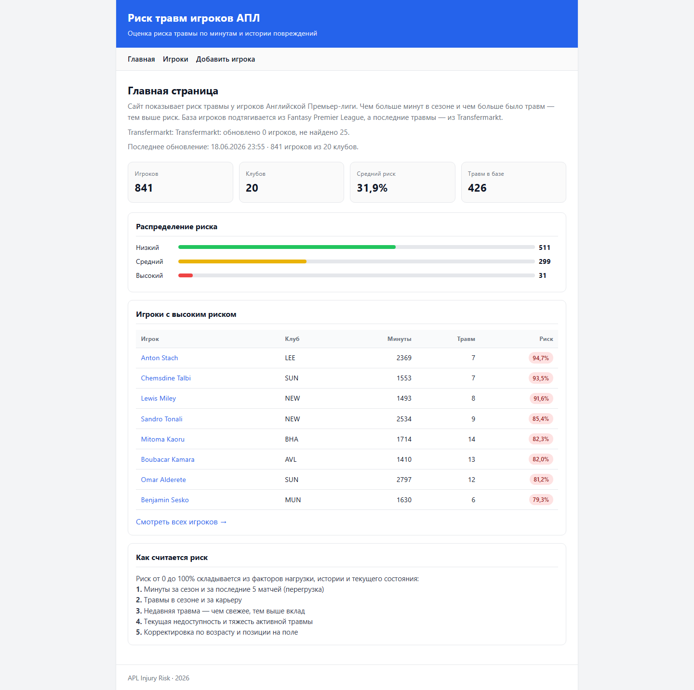
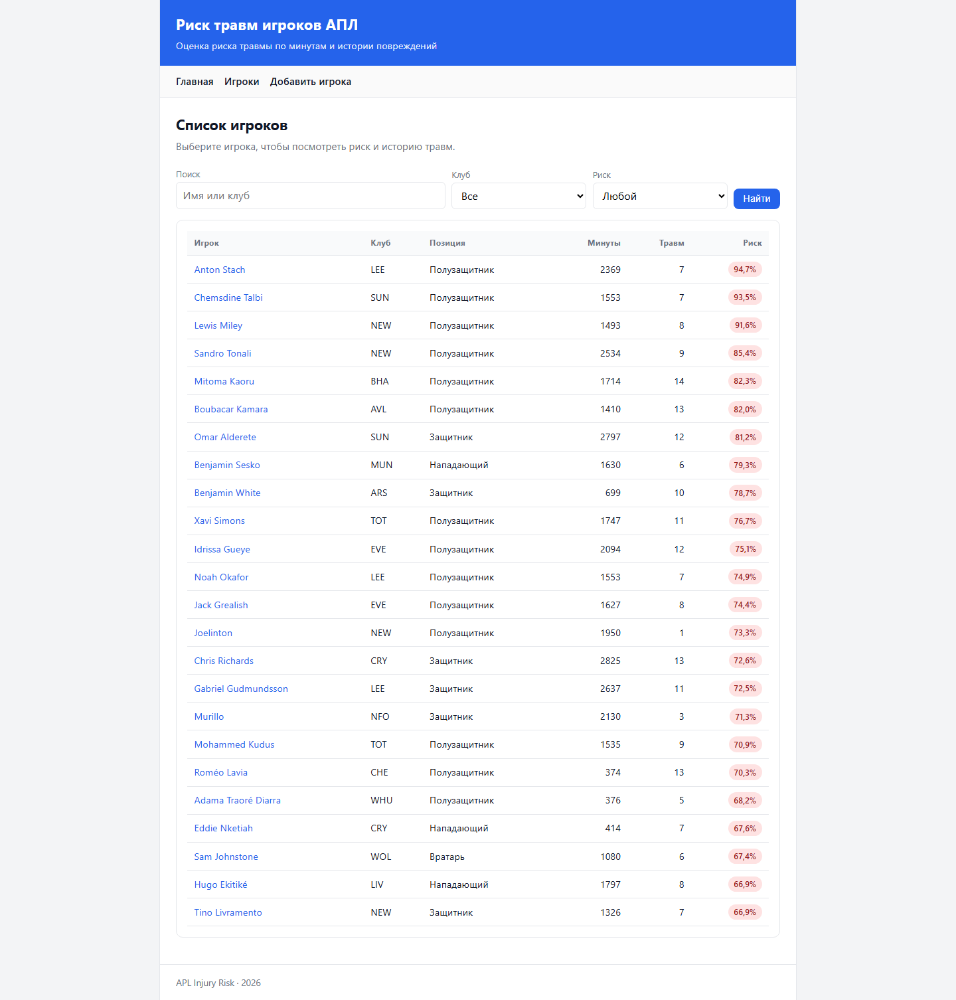
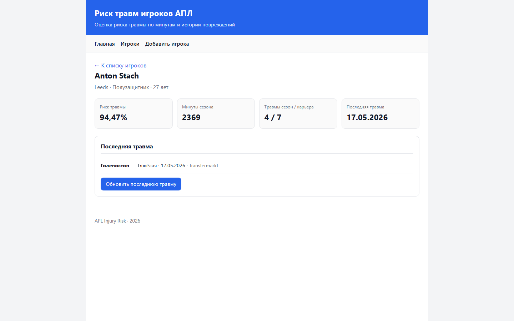

# APL Injury Risk

Веб-сервис для оценки **риска травмы** игроков **Английской Премьер-лиги**.  
Система объединяет данные из открытых источников, рассчитывает риск по нескольким факторам и показывает последнюю травму каждого игрока.

| | |
|---|---|
| **Сайт** | https://l1ksius.pythonanywhere.com |
| **Репозиторий** | https://github.com/lks1us/apl-injury-risk |
| **Стек** | Python 3.10+, Django 5, SQLite, Pandas |

---

## Назначение проекта

Тренерский и медицинский штаб клуба должен быстро понимать, у кого из игроков повышен риск новой травмы.  
Сервис решает эту задачу: собирает актуальную базу игроков АПЛ, подтягивает травмы с Transfermarkt, считает интегральный **risk score** (0–100%) и показывает результат в простом русскоязычном интерфейсе.

---

## Основные функции

### Главная страница
- количество игроков и клубов в базе;
- средний риск травмы;
- распределение игроков по уровням риска (низкий / средний / высокий);
- таблица игроков с наибольшим риском;
- описание формулы расчёта риска.

### Список игроков
- **841 игрок** из 20 клубов АПЛ;
- поиск по имени и клубу;
- фильтр по уровню риска;
- позиции на **русском языке** (вратарь, защитник, полузащитник, нападающий).

### Карточка игрока
- риск травмы в процентах;
- минуты за сезон;
- статистика травм;
- блок **«Последняя травма»** (зона, тяжесть, дата, источник Transfermarkt);
- кнопка **«Обновить последнюю травму»**.

### Добавление игрока
- ручной ввод игрока с указанием зоны и тяжести травмы.

### Админ-панель Django
- полное управление клубами, игроками, травмами и оценками риска: `/admin/`.

---

## Источники данных

| Источник | Что загружается |
|----------|-----------------|
| **Fantasy Premier League API** | клубы, игроки, позиции, минуты за сезон |
| **Transfermarkt** | последняя травма: тип, дата, зона, тяжесть, дни пропуска |

Обновление выполняется командами Django (см. раздел «Запуск»).

---

## Модель расчёта риска

Риск считается модулем `rotations/risk_engine.py` на основе:

1. нагрузки за сезон и за последние 5 матчей;
2. травм в текущем сезоне и за карьеру;
3. давности последней травмы (экспоненциальный спад);
4. текущей недоступности игрока;
5. тяжести активной травмы;
6. корректировки по **возрасту** и **позиции**.

**Уровни риска:**

| Баллы | Уровень |
|-------|---------|
| 0–34  | Низкий |
| 35–64 | Средний |
| ≥ 65  | Высокий |

Подробная спецификация — в [TZ.md](TZ.md).

---

## Скриншоты интерфейса

### Главная страница



### Список игроков



### Карточка игрока



---

## Запуск на локальном компьютере

```bash
git clone https://github.com/lks1us/apl-injury-risk.git
cd apl-injury-risk
python -m venv venv
venv\Scripts\activate          # Windows
pip install -r requirements.txt
python manage.py migrate
python manage.py sync_apl_data --force
python manage.py sync_transfermarkt_injuries --force
python manage.py runserver
```

Сайт: http://127.0.0.1:8000/

> Полная синхронизация Transfermarkt занимает 30–50 минут из‑за ограничений внешнего API.

---

## Развёртывание на PythonAnywhere

Подробная инструкция: [deploy/PYTHONANYWHERE.md](deploy/PYTHONANYWHERE.md)

**Кратко:**

1. Зарегистрироваться на https://www.pythonanywhere.com  
2. Клонировать репозиторий в домашнюю директорию  
3. Создать virtualenv, установить зависимости  
4. Выполнить `migrate`, синхронизацию данных, `collectstatic`  
5. Настроить WSGI и статические файлы  
6. Нажать **Reload** на вкладке Web  

**Рабочий сайт:** https://l1ksius.pythonanywhere.com

Автоматическое обновление через скрипт (при наличии API-токена):

```powershell
$env:PYTHONANYWHERE_API_TOKEN = "ваш-токен"
python deploy/deploy_all.py
```

---

## Структура проекта

```text
apl-injury-risk/
├── apl_risk/           # настройки Django
├── rotations/          # основное приложение
│   ├── models.py       # модели БД
│   ├── risk_engine.py  # расчёт риска
│   ├── services/       # синхронизация FPL и Transfermarkt
│   ├── templates/      # HTML-шаблоны
│   └── management/     # команды sync_apl_data, sync_transfermarkt_injuries
├── deploy/             # деплой на PythonAnywhere
├── docs/screenshots/   # скриншоты для README
├── README.md           # описание проекта (этот файл)
├── TZ.md               # техническое задание
└── requirements.txt
```

---

## Тестирование

```bash
python manage.py test
```

---

## Автор

Учебный проект — **APL Injury Risk**, 2026.
