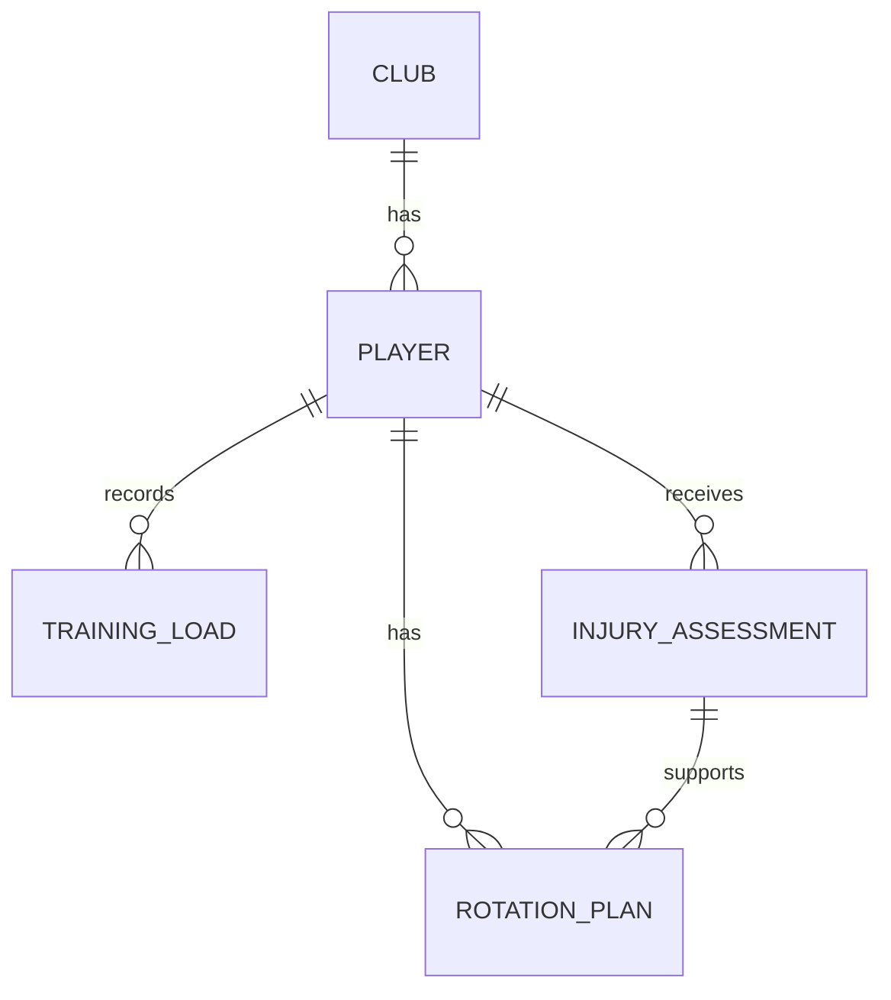

# Техническое задание на проект: APL Injury Risk

## 1. Цель проекта

APL Injury Risk — простой веб-сервис для оценки риска травмы игроков Английской Премьер-лиги.

Главная идея: чем больше игрок провел минут в последних матчах и чем больше у него было прошлых травм, тем выше риск новой травмы.

## 2. Роли пользователей

Гость:
- смотрит панель риска;
- открывает список игроков;
- фильтрует игроков по клубу, позиции и уровню риска.

Аналитик:
- добавляет игроков;
- указывает минуты за последние 5 матчей;
- указывает количество предыдущих травм;
- создает оценку риска.

Администратор:
- управляет всеми данными через Django Admin.

## 3. Модели данных

### Club

Клуб АПЛ.

Поля:
- `name` — название клуба;
- `short_name` — короткий код;
- `city` — город;
- `stadium` — стадион;
- `medical_budget` — условный бюджет медицинского отдела.

Связь: один клуб имеет много игроков.

### Player

Игрок клуба.

Поля:
- `club` — связь с Club;
- `full_name` — имя игрока;
- `position` — позиция;
- `age` — возраст;
- `nationality` — страна;
- `season_minutes` — минуты в текущем сезоне;
- `last_injury_date` — дата последней травмы;
- `season_injuries` — травмы в текущем сезоне;
- `career_injuries` — травмы за карьеру;
- `minutes_last_5` и `previous_injuries` — служебные поля для совместимости и отображения.
- `market_value` — рыночная стоимость;
- `is_available` — доступность игрока.

Связи:
- игрок имеет много оценок риска `InjuryAssessment`;
- игрок имеет много записей нагрузки `TrainingLoad`;
- игрок может иметь планы `RotationPlan` как дополнительную связанную модель.

### InjuryAssessment

Оценка риска травмы.

Поля:
- `player` — связь с Player;
- `date` — дата оценки;
- `risk_score` — автоматически рассчитанный риск;
- `risk_level` — низкий, средний или высокий риск;
- `notes` — комментарий.

Формула:

```text
risk_score = min(100, minutes_component + season_injury_component + career_injury_component + recency_component)
```

Компоненты:

- `minutes_component = min(45, season_minutes / 3420 * 45)`;
- `season_injury_component = min(30, season_injuries * 10)`;
- `career_injury_component = min(20, career_injuries * 3)`;
- `recency_component` — 5, 3, 1 или 0 в зависимости от давности `last_injury_date`.

Уровни: `low` (< 35), `medium` (35–64), `high` (≥ 65).

### TrainingLoad

Запись нагрузки игрока.

Поля:
- `player` — связь с Player;
- `date` — дата;
- `minutes_played` — минуты;
- `distance_km` — дистанция;
- `sprint_count` — спринты;
- `accelerations` — ускорения;
- `perceived_exertion` — субъективная нагрузка;
- `sleep_hours` — сон;
- `soreness_level` — болезненность мышц.

### RotationPlan

Дополнительная связанная модель для архитектуры проекта. В упрощенном интерфейсе она не является основным разделом.

Поля:
- `player` — связь с Player;
- `assessment` — связь с InjuryAssessment;
- `match_date` — дата матча;
- `opponent` — соперник;
- `planned_minutes` — план минут;
- `recommendation` — рекомендация;
- `rationale` — причина.

## 4. Основные сценарии

1. Пользователь открывает главную страницу и видит общий риск по базе игроков.
2. Пользователь смотрит распределение риска по уровням.
3. Пользователь открывает список игроков и сортирует их по риску.
4. Пользователь фильтрует игроков по клубу, позиции или уровню риска.
5. Пользователь открывает карточку игрока и видит минуты, прошлые травмы и историю риска.

## 5. Технический стек

- Python;
- Django;
- SQLite;
- Django ORM;
- Pandas;
- Bootstrap;
- Chart.js.

## 6. Аналитика

Pandas используется в `rotations/analytics.py` для подготовки данных графиков и расчета тренда риска.

## 7. Данные

Seed-команда создает большую демонстрационную выборку: 20 клубов и 100 игроков. Названия клубов и имена игроков взяты из реального контекста АПЛ, а минуты и количество травм используются как демонстрационные учебные признаки.

## 8. ER-диаграмма


