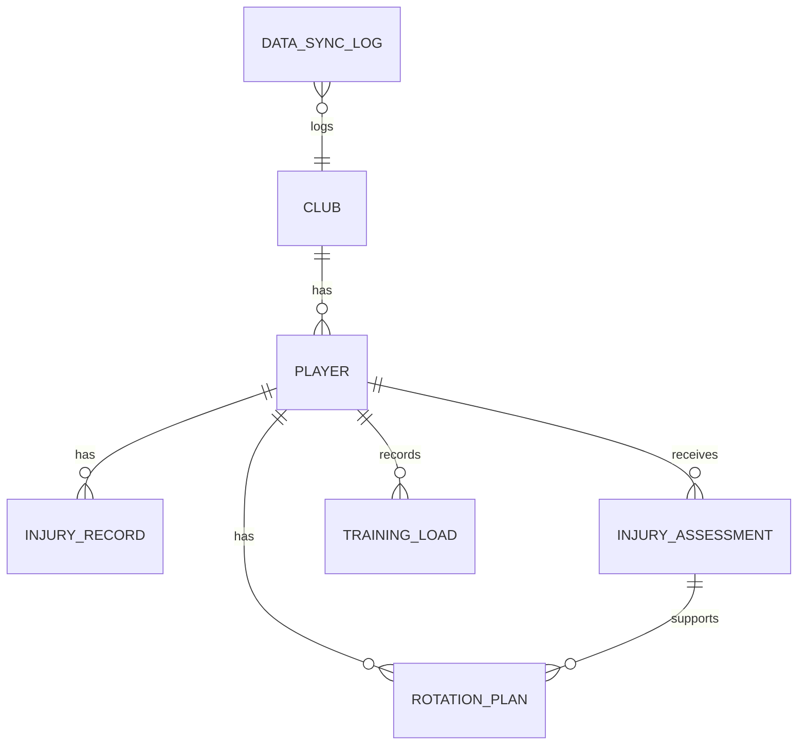

# Техническое задание: APL Injury Risk

## 1. Общие сведения

| Параметр | Значение |
|----------|----------|
| **Название** | APL Injury Risk |
| **Тип** | Веб-приложение (Django) |
| **Предметная область** | Оценка риска травмы игроков Английской Премьер-лиги |
| **Целевая аудитория** | Тренерский и медицинский штаб, аналитики, гости сайта |
| **Рабочий сайт** | https://l1ksius.pythonanywhere.com |
| **Репозиторий** | https://github.com/lks1us/apl-injury-risk |

### 1.1. Цель проекта

Создать работающий веб-сервис, который:

1. хранит актуальную базу игроков АПЛ (841 игрок, 20 клубов);
2. автоматически загружает данные из открытых источников;
3. рассчитывает интегральный **risk score** (0–100%) по многофакторной модели;
4. отображает последнюю травму игрока с Transfermarkt;
5. предоставляет простой русскоязычный интерфейс без регистрации.

### 1.2. Ограничения и допущения

- База данных — **SQLite** (учебный проект, один сервер).
- Авторизация пользователей на публичном сайте **не реализована**; управление данными — через Django Admin.
- Синхронизация внешних данных выполняется **management-командами**, а не при каждом HTTP-запросе (избежание таймаутов на PythonAnywhere).
- Данные Transfermarkt получаются парсингом HTML; возможны частичные сбои из‑за ограничений внешнего сайта.

---

## 2. Роли пользователей

| Роль | Доступ | Действия |
|------|--------|----------|
| **Гость** | Публичный сайт | Просмотр главной, списка игроков, карточки игрока; поиск и фильтрация |
| **Аналитик** | Публичный сайт + форма добавления | Добавление игрока вручную с указанием зоны и тяжести травмы |
| **Администратор** | `/admin/` | Полный CRUD по всем моделям, ручная правка данных, просмотр логов синхронизации |

---

## 3. Структура базы данных

### 3.1. ER-диаграмма



### 3.2. Club (клуб)

| Поле | Тип | Описание |
|------|-----|----------|
| `id` | PK | Первичный ключ |
| `external_id` | int, unique, nullable | ID клуба в FPL API |
| `name` | varchar(120), unique | Полное название |
| `short_name` | varchar(12), unique | Краткий код (ARS, MCI…) |
| `city` | varchar(80) | Город |
| `stadium` | varchar(120) | Стадион |
| `medical_budget` | decimal | Условный бюджет медотдела (млн £) |

**Связи:** `Club` 1 → N `Player`.

### 3.3. Player (игрок)

| Поле | Тип | Описание |
|------|-----|----------|
| `id` | PK | Первичный ключ |
| `club_id` | FK → Club | Клуб |
| `external_id` | int, unique, nullable | ID в FPL API |
| `transfermarkt_id` | int, nullable | ID на Transfermarkt |
| `data_source` | enum: manual / fpl | Источник записи |
| `last_synced_at` | datetime, nullable | Время последней синхронизации |
| `full_name` | varchar(120) | ФИО |
| `position` | enum: GK / DF / MF / FW | Позиция (отображение на русском) |
| `age` | smallint (16–45) | Возраст |
| `nationality` | varchar(80) | Гражданство |
| `dominant_foot` | varchar(20) | Рабочая нога |
| `market_value` | decimal | Рыночная стоимость (млн £) |
| `season_minutes` | int (0–4000) | Минуты за текущий сезон |
| `minutes_last_5` | int | Минуты за последние 5 матчей |
| `last_injury_date` | date, nullable | Дата последней травмы |
| `season_injuries` | int (0–20) | Травмы в сезоне |
| `career_injuries` | int (0–60) | Травмы за карьеру |
| `previous_injuries` | int | Служебное поле (совместимость) |
| `injury_history_score` | int (0–100) | Legacy-фактор |
| `is_available` | bool | Доступен ли игрок |

**Ограничения:** unique `(club, full_name)`.

**Связи:** Player 1 → N InjuryRecord, InjuryAssessment, TrainingLoad, RotationPlan.

### 3.4. InjuryRecord (запись о травме)

| Поле | Тип | Описание |
|------|-----|----------|
| `id` | PK | |
| `player_id` | FK → Player | |
| `injury_date` | date | Дата травмы |
| `body_part` | enum | Зона: колено, бедро, голеностоп, пах, икра, плечо, спина, голова, другое |
| `injury_type` | varchar(80) | Тип травмы (текст) |
| `severity` | enum: minor / moderate / severe | Тяжесть |
| `days_out` | int (0–365) | Дней пропуска |
| `matches_missed` | int | Пропущенные матчи |
| `recovery_date` | date, nullable | Дата возвращения |
| `treatment` | varchar(120) | Лечение |
| `description` | text | Описание |
| `created_at` | datetime | Время создания записи |

**Источник:** Transfermarkt (автосинхронизация) или ручной ввод при добавлении игрока.

### 3.5. InjuryAssessment (оценка риска)

| Поле | Тип | Описание |
|------|-----|----------|
| `id` | PK | |
| `player_id` | FK → Player | |
| `date` | date | Дата оценки |
| `season_minutes_at_assessment` | int, nullable | Снимок минут на момент оценки |
| `last_injury_date_at_assessment` | date, nullable | Снимок даты травмы |
| `season_injuries_at_assessment` | int, nullable | Снимок травм в сезоне |
| `career_injuries_at_assessment` | int, nullable | Снимок карьерных травм |
| `muscle_fatigue` | int (0–100) | Усталость мышц |
| `joint_stability` | int (0–100) | Стабильность суставов |
| `previous_injury_factor` | int (0–100) | Фактор прошлых травм |
| `recovery_score` | int (0–100) | Оценка восстановления |
| `risk_score` | decimal | **Автоматически** рассчитанный риск (0–100) |
| `risk_level` | enum: low / medium / high | **Автоматически** определённый уровень |
| `notes` | text | Комментарий |
| `created_at` | datetime | |

**Ограничения:** unique `(player, date)`.

При сохранении вызывается `risk_engine.calculate_player_risk()`.

### 3.6. TrainingLoad (тренировочная нагрузка)

| Поле | Тип | Описание |
|------|-----|----------|
| `player_id` | FK → Player | |
| `date` | date | |
| `minutes_played` | int (0–130) | |
| `distance_km` | decimal | |
| `sprint_count` | int | |
| `accelerations` | int | |
| `perceived_exertion` | int (1–10) | RPE |
| `sleep_hours` | decimal | |
| `soreness_level` | int (0–10) | |

**Ограничения:** unique `(player, date)`.

Модель заложена в архитектуру; в упрощённом UI не является основным разделом.

### 3.7. RotationPlan (план ротации)

| Поле | Тип | Описание |
|------|-----|----------|
| `player_id` | FK → Player | |
| `assessment_id` | FK → InjuryAssessment, nullable | |
| `match_date` | date | |
| `opponent` | varchar(120) | |
| `planned_minutes` | int (0–120) | |
| `recommendation` | enum | start / limited / rest / medical_review |
| `rationale` | text | |

Дополнительная модель для расширения; в текущем UI не выведена отдельным разделом.

### 3.8. DataSyncLog (журнал синхронизации)

| Поле | Тип | Описание |
|------|-----|----------|
| `source` | varchar(40) | fpl / transfermarkt |
| `synced_at` | datetime | Время синхронизации |
| `status` | enum: success / failed | |
| `players_synced` | int | Количество обработанных игроков |
| `clubs_synced` | int | Количество клубов |
| `message` | text | Детали / ошибки |

---

## 4. Логика работы сервиса

### 4.1. Поток данных

```text
[FPL API] ──sync_apl_data──► Club + Player (минуты, позиции)
                                    │
                                    ▼
[Transfermarkt] ──sync_transfermarkt_injuries──► InjuryRecord + last_injury_date
                                    │
                                    ▼
                         recalculate_risks ──► InjuryAssessment (risk_score)
                                    │
                                    ▼
                              Веб-интерфейс
```

### 4.2. Management-команды

| Команда | Назначение |
|---------|------------|
| `sync_apl_data [--force]` | Загрузка/обновление клубов и игроков из FPL |
| `sync_transfermarkt_injuries [--force]` | Загрузка последних травм с Transfermarkt |
| `recalculate_risks` | Пересчёт InjuryAssessment для всех игроков |
| `seed_demo` | Начальное заполнение демо-данными (локальная разработка) |

### 4.3. Модель расчёта риска (`rotations/risk_engine.py`)

Итоговый балл = сумма компонентов × **position_factor** × **age_factor**, ограничение 100.

| Компонент | Макс. балл | Логика |
|-----------|------------|--------|
| Нагрузка за сезон | 24 | Зависимость от `season_minutes` (cap 3420), перегрузка > 2700 мин |
| Нагрузка за 5 матчей | 14 | `minutes_last_5` / 450 |
| Травмы в сезоне | 18 | Линейно + sqrt-коррекция |
| История травм | 14 | log₂(career_injuries + 1) |
| Недавняя травма | 18 | Экспоненциальный спад: 18 × e^(−days/42) |
| Текущий статус | 10 | +10 если `is_available = False` |
| Активная травма | 12 | +4 / +8 / +12 по тяжести (minor / moderate / severe) |
| Медицинские показатели | 8 | Из полей InjuryAssessment (если есть) |

**Множители позиции:** GK 0.88, DF 0.94, MF 1.0, FW 1.07.

**Множитель возраста:** ≤21 → 1.04; 22–28 → 1.0; 29–32 → 1.05; >32 → до 1.18.

**Уровни риска:**

| risk_score | risk_level |
|------------|------------|
| 0–34 | low (Низкий) |
| 35–64 | medium (Средний) |
| ≥ 65 | high (Высокий) |

### 4.4. Сценарии использования

#### Сценарий 1: Просмотр дашборда
1. Пользователь открывает `/`.
2. Система показывает: число игроков/клубов, средний риск, распределение по уровням, топ-10 рискованных игроков.
3. Отображается дата последней успешной синхронизации FPL (из DataSyncLog).

#### Сценарий 2: Поиск игрока
1. Пользователь переходит на `/players/`.
2. Вводит имя или фильтрует по уровню риска.
3. Получает постраничный список (24 игрока на страницу) с риском, клубом, позицией на русском.

#### Сценарий 3: Карточка игрока
1. Пользователь открывает `/players/<id>/`.
2. Видит risk score, минуты, статистику травм.
3. В блоке «Последняя травма» — зона, тяжесть, дата, источник Transfermarkt.
4. Может нажать «Обновить последнюю травму» → POST-запрос к Transfermarkt для одного игрока.

#### Сценарий 4: Добавление игрока
1. Пользователь открывает `/players/add/`.
2. Заполняет: клуб, имя, позицию, минуты.
3. Опционально указывает **зону** и **тяжесть** травмы (оба поля обязательны в паре).
4. Система создаёт Player + InjuryRecord + InjuryAssessment.

#### Сценарий 5: Администрирование
1. Администратор входит в `/admin/`.
2. Редактирует любые записи, просматривает DataSyncLog.

---

## 5. Веб-интерфейс

### 5.1. Навигация (3 пункта)

| URL | Страница |
|-----|----------|
| `/` | Главная (дашборд) |
| `/players/` | Список игроков |
| `/players/add/` | Добавить игрока |

### 5.2. Требования к UI

- Русский язык интерфейса.
- Позиции игроков на русском (Вратарь, Защитник, Полузащитник, Нападающий).
- Собственный CSS (`rotations/static/rotations/site.css`), без Bootstrap/Chart.js.
- Адаптивная вёрстка для desktop.

---

## 6. Технический стек

| Слой | Технология |
|------|------------|
| Backend | Python 3.10+, Django 5 |
| БД | SQLite |
| Аналитика | Pandas (`rotations/analytics.py`) |
| Frontend | Django Templates, HTML, CSS |
| Деплой | PythonAnywhere (WSGI) |
| VCS | Git, GitHub |
| Тесты | Django TestCase (`tests.py`, `tests_risk.py`, `tests_sync.py`, `tests_transfermarkt.py`) |

---

## 7. Развёртывание

### 7.1. Локально

```bash
python -m venv venv && venv\Scripts\activate
pip install -r requirements.txt
python manage.py migrate
python manage.py sync_apl_data --force
python manage.py sync_transfermarkt_injuries --force
python manage.py runserver
```

### 7.2. PythonAnywhere

1. `git clone` репозитория.
2. Virtualenv + `pip install -r requirements.txt`.
3. `migrate`, синхронизация данных, `collectstatic`.
4. Настройка WSGI (`apl_risk.wsgi`), static files mapping.
5. Reload web app.

Подробности: `deploy/PYTHONANYWHERE.md`.

---

## 8. Критерии приёмки

- [x] Работающий сайт на PythonAnywhere с 800+ игроками.
- [x] Автозагрузка данных из FPL API.
- [x] Загрузка травм с Transfermarkt.
- [x] Многофакторный расчёт риска с уровнями low/medium/high.
- [x] Русскоязычный интерфейс (3 раздела навигации).
- [x] README.md с описанием, скриншотами и инструкцией деплоя.
- [x] TZ.md с моделями, ролями и логикой сервиса.
- [x] Репозиторий на GitHub.
- [x] Unit-тесты для risk engine и синхронизации.

---

## 9. Структура репозитория

```text
apl-injury-risk/
├── apl_risk/              # settings, urls, wsgi
├── rotations/             # основное приложение
│   ├── models.py
│   ├── risk_engine.py
│   ├── views.py, forms.py, urls.py
│   ├── services/          # fpl_sync.py, transfermarkt_sync.py
│   ├── management/commands/
│   ├── migrations/
│   ├── templates/
│   └── tests*.py
├── deploy/                # скрипты деплоя
├── docs/screenshots/      # скриншоты
├── README.md
├── TZ.md
└── requirements.txt
```
